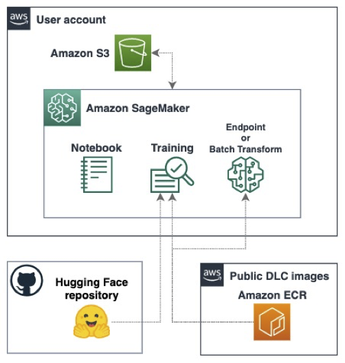

## Classifying news with Amazon’s BORT using Amazon SageMaker and Hugging Face

In this example, we explore how to perform a Text Classification task from end to end, by relying on Amazon SageMaker with the Hugging Face containers and SageMaker Python SDK.

We also rely on the library of pre-trained models in Hugging Face and in particular will use Amazon’s BORT, a lightweight model developed by Amazon Alexa’s team that trains faster than other BERT-like transformers for NLP tasks. We will also learn how to use our own custom data fine tuning the pre-trained models, and relying on Hugging Face’ scripts for speeding up the process on tasks such as tokenization and data loading. Finally, we will perform some real-time test inferences to SageMaker endpoints with some sample phrases on our text classification models.

For more details on this example check the AWS ML Blog post: (LINK)

[Sample notebook](./Classify_news_SM_HF.ipynb)

## Security

See [CONTRIBUTING](CONTRIBUTING.md#security-issue-notifications) for more information.

## License

This library is licensed under the MIT-0 License. See the LICENSE file.

